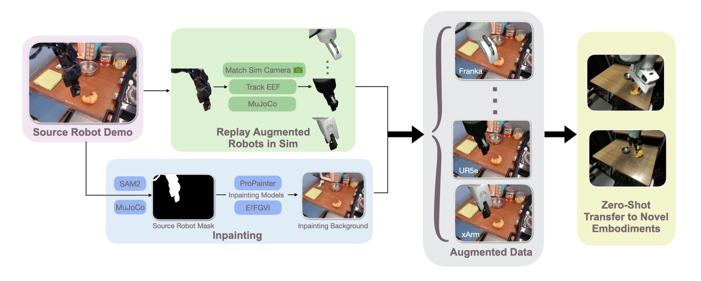
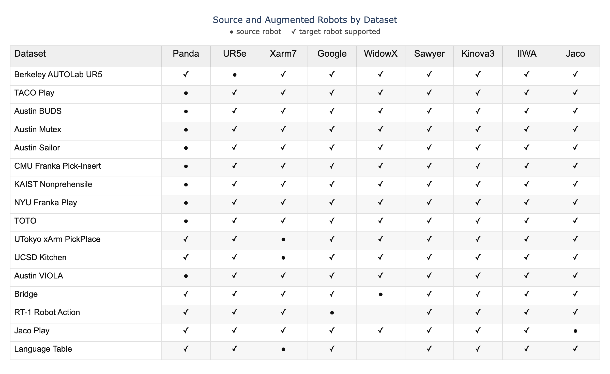
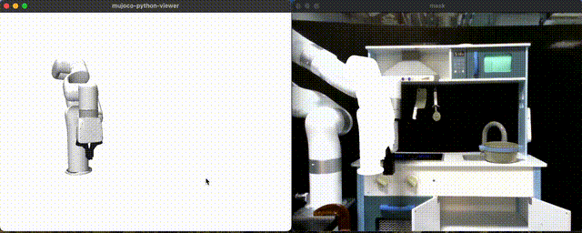
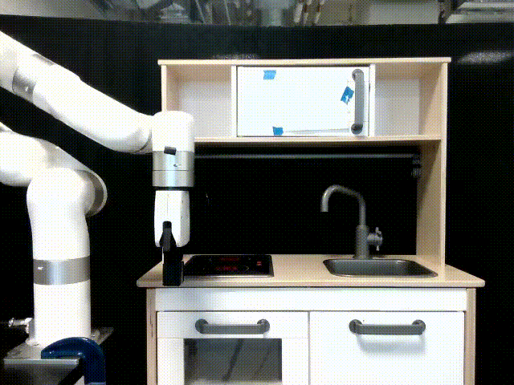
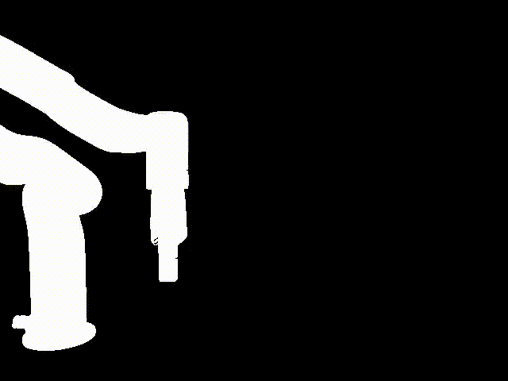
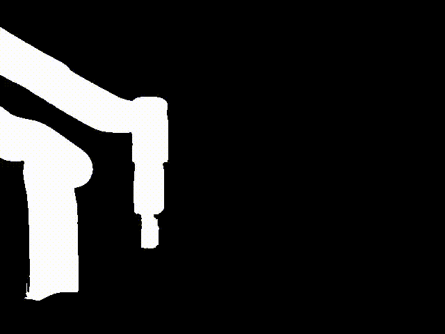
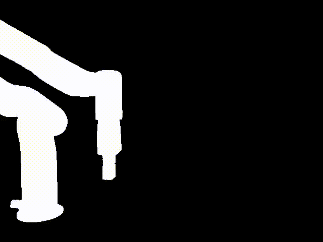
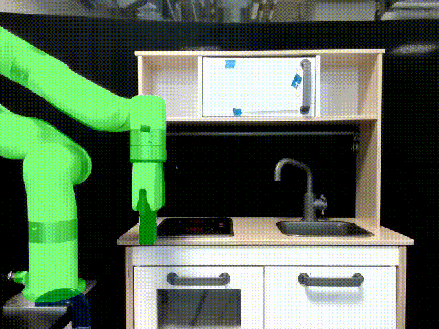
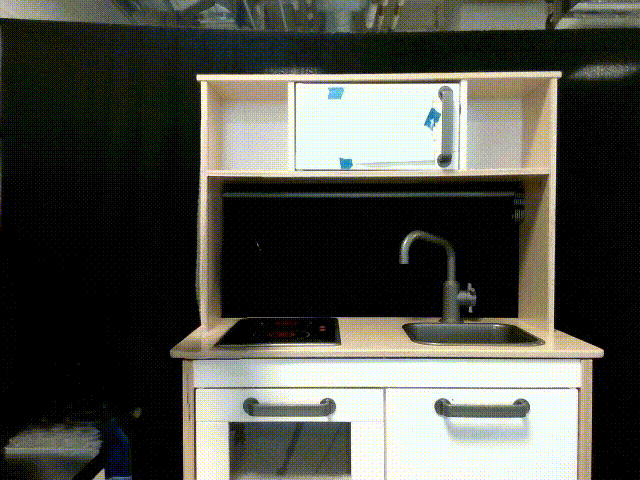
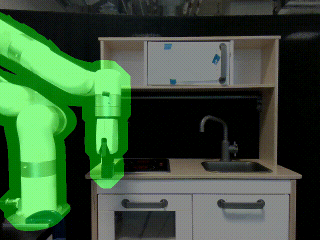

<p align="center">
  
</p>

<p align="center">
  <a href="https://oxe-auge.github.io/">
    
  </a>
  <a href="https://arxiv.org/abs/2512.13100">
    
  </a>
  <a href="https://huggingface.co/oxe-auge">
    
  </a>
  <a href="https://twitter.com/TODO">
    
  </a>
</p>

# OXE-AugE

OXE-AugE is a simulation-grounded augmentation pipeline that can cross-paint OXE datasets into many robot embodiments. Scaling augmentation consistently boosts performance on seen and unseen robots, and yields substantial real-world gains when fine-tuning state-of-the-art generalist policies.  
This repository provides the official implementation of [OXE++: Scaling Robot Augmentation for Cross-Embodiment Policy Learning
](https://oxe-auge.github.io/).

---

## Installation

### Environments

To manage dependencies, we separate the pipeline into dedicated Conda environments (with two optional environments for dataset consolidation):

- **simulation environment (sim-env)** — MuJoCo-based source-trajectory tracking and target-robot replay.
- **sam environment (sam2)** — SAM2 with fine-tuned checkpoints to produce frame-wise trajectory masks.
- **inpainting environment (e2fgvi)** — E2FGVI to remove the source robot and reconstruct the scene background.

**Optional:** LeRobot/RLDS consolidation environments for unifying datasets before and after augmentation.

> For a reliable setup, proceed through the README in order; it covers every installation detail.

# Clone with submodules

```bash
git clone --recurse-submodules https://github.com/GuanhuaJi/oxe-auge.git
```

---

# Pipeline in detail
<p align="center">
  
</p>

Each part of the pipeline runs in its own conda environment due to dependency conflicts. 


## Overview

An OXE dataset with a **fixed third-person camera view** can be augmented in the following way:

**End-to-end pipeline:**

1. Configure your dataset
2. Tune camera
3. Trace source-robot trajectory
4. Generate SAM2 masks for trajectories
5. (If multiple views) Match viewpoints
6. Merge simulation and SAM masks
7. Inpaint with E2FGVI
8. Replay on target robot
9. *(Optional)* Construct LeRobot/RLDS dataset

**Environment Setup**

1. **Simulation env (steps 1, 2, 3, 5, 8)**
   ```bash
   cd AugE-Toolkit
   conda env create -f environment.yml
   conda activate sim-env
   ```

2. **SAM2 env (steps 4, 6)**
   - Requires `python>=3.10`, `torch>=2.5.1`, `torchvision>=0.20.1` (follow the [PyTorch install guide](https://pytorch.org/get-started/locally/)).
   ```bash
   conda create -n sam2 python=3.10 -y
   conda activate sam2
   cd sam2
   pip install -e .
   ```
   - Download the fine-tuned checkpoints from [here](https://drive.google.com/drive/folders/1qytIg9Y0Myb78Jt8c0TV9FOogrNd23Bl?usp=drive_link) and place them in the `checkpoints/` folder.
   - See [`sam2/README.md`](sam2/README.md) if installation issues arise.

3. **E2FGVI env (step 7)**
   ```bash
   conda create -n e2fgvi python=3.9 -y
   conda activate e2fgvi

   conda config --env --set channel_priority strict
   conda install pytorch==2.4.1 torchvision pytorch-cuda=12.1 -c pytorch -c nvidia
   pip install mmcv==2.2.0 -f https://download.openmmlab.com/mmcv/dist/cu121/torch2.4/index.html
   conda install tensorboard matplotlib scikit-image tqdm
   pip install -U imageio imageio-ffmpeg
   ```

4. **LeRobot / RLDS env (step 9)**
   - Follow [lerobot_dataset_builder/README.md](lerobot_dataset_builder/README.md) and [rlds_dataset_builder/README.md](rlds_dataset_builder/README.md) for installation instructions.
---

## Augmented Pairs in OXE-AugE

We provide augmentations on 16 datasets, each augmented to 8-9 robots. The table below shows the source robot and available augmented robots. In total, OXE-AugE consists of over 4.4M trajectories, which you can download from [HuggingFace](https://huggingface.co/oxe-auge). It is also easy to apply AugE-Toolkit to other OXE datasets or your datasets and robots.

<p align="center">
  
</p>

---

# Setting up a new robot (optional)

We provide 9 robots out of the box (Franka Panda, UR5e, Xarm7, Google Robot, WidowX, Sawyer, Kinova3, IIWA, Jaco). If the robot you need isn’t included, follow the steps below to set up a new robot.

## XML Setup
1) Convert your robot URDF to xml, or pick a model from MuJoCo Menagerie
2) Your need your MJCF filestructure to include `<your_robot>/robot.xml` and `<your_robot>/scene.xml`. The first must include your high-level robot XML description. `scene.xml` can be copied from any of the robot subdirs in this github's `robot.xml ` 

## Gripper Measurement
3) Install mujoco and run `python -m mujoco.viewer`. Drop in `<your_robot>/scene.xml`. Place an attachment site where you'd like your end effector to be. An example: `<site name="attachment_site" pos="0 0 0" size="0.03" rgba="1 0 0 0"/>`. Tip: Set `rbga=1 0 0 1` to visualize your site in the mujoco viewer.
4) We'll need to map gripper fingers from your custom robot to a uniform space. Add two more attachment sites to your robot's left and right finger grippers. Example: `<site name="left_fingertip" pos="0 0 0.04" size="0.005" rgba="0 0 1 0"/>` and `<site name="right_fingertip" pos="0 0 0.04" size="0.005" rgba="0 0 1 0"/>`. Use the mujoco viewer to make the sites track the gripper tips as it opens and closes.
5) Fill out and run `track_fingers.py` with your robot's actuators and desired actuator range (you can get these from the mujoco viewer). Running the file should slowly close your robot gripper and store the measurements in `gripper_robot_pairings.json`. Copy your desired actuator range to `GRIPPER_RANGES` in `core/gripper_utils.py`. Also updated `GRIPPER_JOINT_IDS` to a list of your gripper joint indices. 

You should be good to run replay with your new robot now!

---

## Step-by-step

### Step 1 — Configure your dataset

1. **Select an OXE dataset with a fixed third-person view.** Use the [official OXE dataset catalog](https://docs.google.com/spreadsheets/d/1rPBD77tk60AEIGZrGSODwyyzs5FgCU9Uz3h-3_t2A9g/edit?gid=0#gid=0) to find a suitable candidate.

2. **Create a processing function in `processing_utils.py`.** The function must load an RLDS episode and hand back the control stream plus observations for the downstream stages.
   - Default return values: `joint_angles`, `image`, and `gripper_states`.
   - If joint angles are missing, instead provide `eef_xyz`, `eef_quat`, `image`, and `gripper_states`. See `processing_utils.py` for the expected shapes and naming.

3. **Add a dataset entry in `config.py`.** Fill out every field except `viewpoints`, `extend_gripper` and `viewpoint_matching` for now; you can revisit those later. Example:

```python
"jaco_play": {
    # skip viewpoints for step 1, we will complete viewpoint at step 2
    "viewpoints": [{
        "lookat": [-0.13805259, -0.46769665,  0.01131256],
        "distance": 0.790969149319087,
        "azimuth": 88.5309361049106,
        "elevation": -44.80357142857134,
        "episodes": {
            "train": list(range(976)),
            "test": list(range(109))
        }
    }],
    "process_function" : "process_jaco_play", # name of your processing function
    "out_path": "../videos", # where do you want output to be saved
    "extend_gripper": 0.0, # fill this at step 8
    "use_joint_angles": True, # whether the source robot is controlled by eef or joint angles
    "source_robot": "jaco", # source robot type
    "viewpoint_matching": True, # fill this at step 2
    "num_episodes": {
        "train": 976, # num of episode in train dataset
        "test": 101 # num of episode in test dataset
    }
},
```


### Step 2 — Tune camera

Camera tuning currently requires macOS because the MuJoCo viewer uses native windowing. Follow the steps below to capture the camera parameters for the trajectory you want to augment.

> `--dataset` must be set to the **Registered Dataset Name** from the [official OXE dataset catalog](https://docs.google.com/spreadsheets/d/1rPBD77tk60AEIGZrGSODwyyzs5FgCU9Uz3h-3_t2A9g/edit?gid=0#gid=0); every subsequent `--dataset` flag in this guide refers to that same column.

<p align="center">
  
</p>

1. **Activate the simulation environment**  
   ```bash
   conda activate sim-env
   ```

2. **Launch the tuning script for the target episode** (replace placeholders with your values):  
   ```bash
   python -m core.cam_tuning \
     --dataset <DATASET_NAME> \
     --traj_number <EPISODE_ID> \
     --split <train|val|test> \
     --camera_fov <FOV_DEGREES>
   ```

3. **Interact with the viewer**  
   - Two windows open: the simulated robot view and the reference episode with its mask.  
   - Drag with the mouse in the simulation window to orbit the camera; scroll to zoom.  
   - Press `SPACE` to play/pause the trajectory so you can check multiple frames.  
   - Adjust until the simulated arm overlaps the masked robot throughout the sequence.

4. **Record the parameters**  
   The console prints the latest camera settings in the following format:  
   ```
               "lookat": [0.35624648, 0.18027023, 0.26440381],
               "distance": 1.0102697170162116,
               "azimuth": 91.74973347547972,
               "elevation": -3.5082622601279727,
               "camera_fov": 45.0,
   ```
   Copy these values into the corresponding dataset entry in `config.py`.

**Tips**
- If the mask aligns on some frames but not others, experiment with `camera_fov` to widen or tighten the view.
- Certain datasets ship with imperfect joint/image synchronisation. Minor misalignments on a few frames are acceptable, especially since the inpainting stage includes dilation. Aim to match the majority of the trajectory, and consider refining your `processing_utils.py` loader if the gap is large.


### Step 3 — Source-robot trajectory tracing

   ```bash
   cd AugE-Toolkit
   conda activate sim-env
   ```

1. **Run the tracker for the trajectories you need.**

   ```bash
   python -m core.track_source_trajectory \
       --dataset=<DATASET> \
       --split=<train|val|test> \
       --start=<START_EP> \
       --end=<END_EP>
   ```

   - Swap `--start/--end` for `--traj_number <EPISODE>` when processing a single rollout.
   - Episode ranges follow Python slicing semantics: `--start=0 --end=10` covers episodes 0–9.

Example source video and mask clips (GIF previews — click for the MP4 originals):

| source video | mask |
| --- | --- |
| [](docs/ucsd_kitchen_source_web.mp4) | [](docs/ucsd_kitchen_mask_web.mp4) |


### Step 4 — Generate SAM2 masks for trajectories

Run Steps 4 and 6 inside the SAM2 environment:

```bash
cd sam2
conda activate sam2
python sam2/inference.py \
  --dataset <dataset_name> \
  --split <split_name> \
  --start <START_EP> --end <END_EP>
```

you should see files:
```text
<out_path>/<dataset>/<split>/<episode>/
├── sam_mask.mp4      # binary SAM mask (255 where SAM segments the manipulator)
└── sam_overlay.mp4   # original RGB frames with the SAM mask alpha-blended for quick inspection
```

Example sam mask and sam overlay clips (GIF previews — click for the MP4 originals):

| sam mask | sam overlay |
| --- | --- |
| [](docs/ucsd_kitchen_sam_mask_web.mp4) | [](docs/ucsd_kitchen_sam_overlay_web.mp4) |


### Step 5 — Viewpoint matching *(if multiple views)*

Return to the simulation environment before launching the selector:

```bash
cd AugE-Toolkit
conda activate sim-env
```

1. **Handle multi-view datasets (if applicable).** Skip this when the dataset exposes a single fixed viewpoint. Otherwise, select the best camera by running:

   ```bash
   python -m core.select_viewpoint --dataset <DATASET> --split <train|val|test> --traj_number <EPISODE>
   ```

   For large batches, run the helper script instead:

   ```bash
   python -m pipelines.bulk_select_viewpoint <START_EP> <END_EP> --dataset <DATASET> --split <train|val|test> --workers <NUM_WORKERS>
   ```

2. **Review viewpoint-matching artefacts.** After running the selector, check that the diagnostics look reasonable.

   ```text
   <out_path>/<dataset>/<split>/<episode>/
   └── viewpoint_matching/
       ├── all_ious.npy
       ├── best_matches.txt
       ├── best_masks_video.mp4
       ├── overlay_video.mp4
       └── comparison_visualization/
           └── *.png
   ```
   - `all_ious.npy`: IoU scores for every SAM mask vs. replay mask comparison.
   - `best_matches.txt`: text summary of the best replay frame per SAM mask.
   - `best_masks_video.mp4`: linear playback of the winning replay masks.
   - `overlay_video.mp4`: overlay of the replay mask (green) on the SAM mask.
   - `comparison_visualization/`: PNG snapshots of the IoU comparisons.


### Step 6 — Merge simulation and SAM masks

Neither mask source is perfect on its own:
- **simulation mask:** always contains the full manipulator, but slight pose mismatches appear when the replay camera / kinematics drift.
- **SAM mask:** aligns well with the video but can miss links or include stray pixels on difficult frames.

`sam2/merge_mask.py` combines both signals in the SAM2 environment. It shifts the simulation mask to match SAM mask, prunes any regions that drift too far from the shifted simulation mask's contour, and outputs a union mask that keeps SAM mask's alignment and simulation mask's completeness.

```bash
python merge_mask.py \
  --dataset <DATASET> \
  --split <train|val|test> \
  --start <START_EP> --end <END_EP> \
  --max_pix <PIXEL_SHIFT> \
  --sam_radius <SAM_RADIUS>
```

- `--max_pix` bounds the pixel shift when aligning the simulation mask to SAM.
- `--sam_radius` trims SAM regions that drift beyond the shifted simulation contour.

Example merged mask clips (GIF previews — click for the MP4 originals):

| merged mask | overlay preview |
| --- | --- |
| [](docs/ucsd_kitchen_merged_mask_web.mp4) | [](docs/ucsd_kitchen_merged_mask_overlay_web.mp4) |

Since this step feeds directly into inpainting quality, iterate on the settings until the green overlay looks clean.

### Step 7 — Inpainting with E2FGVI

Activate the inpainting environment and run the batch script from the E2FGVI module. Adjust the episode range and `--dilution` (mask dilation) for your dataset if needed.

```bash
conda activate e2fgvi
cd e2fgvi
python batched_inference_e2fgvi.py --dataset <DATASET> --split <train|test> --start <START_EP> --end <END_EP> --dilution <MASK_DILATION>
```

Typical outputs (click to open the MP4s):

| inpainting | inpainting mask |
| --- | --- |
| [](docs/ucsd_kitchen_inpaint_e2fgvi.mp4) | [](docs/ucsd_kitchen_mask_in_e2fgvi.mp4) |

### Step 8 — Replay on target robot

```bash
cd AugE-Toolkit
conda activate sim-env
```

Launch the replay against the inpainted background using the target robot:

```bash
python -m core.replay_target_robot \
  --dataset <DATASET> \
  --split <SPLIT> \
  --traj_number <TRAJECTORY_ID> \
  --robot <TARGET_ROBOT> \
  --translation <TX> <TY> <TZ>
```

The translation vector shifts the entire trajectory in world space; start with zeros and adjust as needed. If the robot clips its workspace:

- Refine the offset with iterative replay feedback: `python -m pipelines.translation_tuning --robot <TARGET_ROBOT> --dataset <DATASET> --split <SPLIT> --traj <TRAJECTORY_ID> --csv <CSV_PATH>`.

**Sample overlays**


### Step 9 (Optional) — Construct LeRobot/RLDS dataset

Follow [lerobot_dataset_builder/README.md](lerobot_dataset_builder/README.md) and [rlds_dataset_builder/README.md](rlds_dataset_builder/README.md) for installation instructions and usage.


## Companion Repositories (Optional)

The OXE-AugE pipeline in this repo is **self-contained**—you do **not** need the repos below to run augmentation.  
They are provided **only for optional reproduction/extension** of results built on top of OXE-AugE outputs:

- **Simulation Experiments (optional)**: simulator-based experiments using RoboMimic augmented trajectories, with reproduction scripts [here](https://github.com/daringtrifles/oxe_auge_sim_exp).
- **Simulator Data Generation (optional)**: a separate toolkit for generating RoboMimic augmented datasets [here](https://github.com/GuanhuaJi/oxe_auge_sim_augmentation.git).


# Citation
If you found this paper / code useful, please consider citing: 

```
@misc{
  ji2025oxeauge,
  title  = {OXE-AugE: A Large-Scale Robot Augmentation of OXE for Scaling Cross-Embodiment Policy Learning},
  author = {Ji, Guanhua and Polavaram, Harsha and Chen, Lawrence Yunliang and Bajamahal, Sandeep and Ma, Zehan and Adebola, Simeon and Xu, Chenfeng and Goldberg, Ken},
  journal={arXiv preprint arXiv:2512.13100},
  year={2025}
}
```

# License
This project is licensed under the MIT License. See the LICENSE file for more details.

# Contact
For questions or issues, please reach out to Guanhua Ji **jgh1013@seas.upenn.edu** or open an issue.
